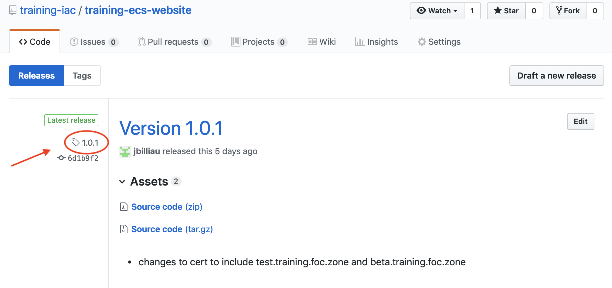
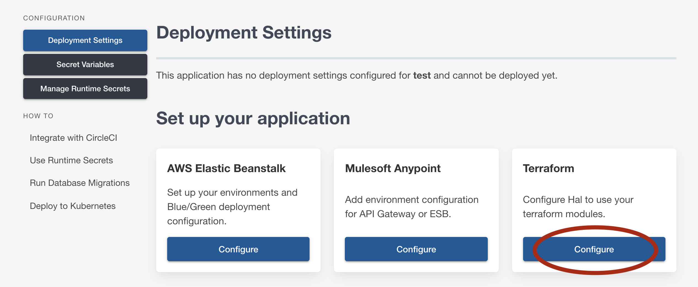
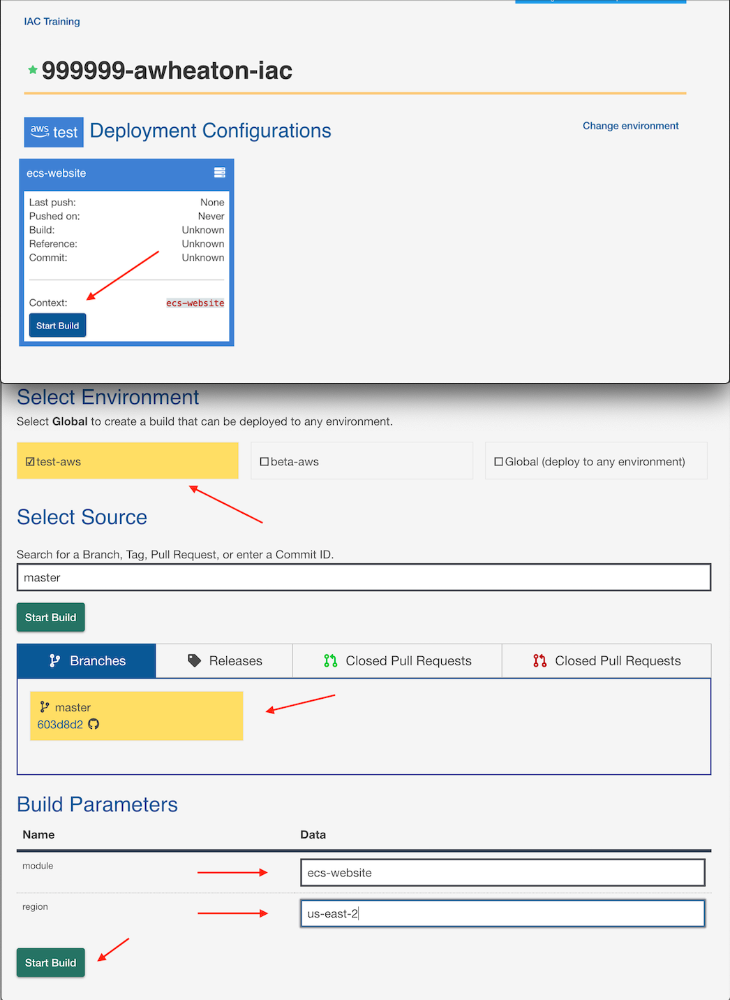

# Lab 2

For this lab we will use HAL and GIT to build the infrastructure and deploy a sample application to the ECS cluster.  This will be laying down the base infrastructure onto which you will deploy your Docker container you built in the Docker class.  We will do that in the final class (CircleCI/HAL) but for now, let's get the infrastructure stood up.

First, if you haven't created the "999999-YOURNAME-iac" repo yet under your own personal profile, you will want to follow the directions [HERE](https://git.rockfin.com/training-iac/training-starter-kit#setting-up-git) to set up GIT

Once done, follow the instructions below for setting up a HAL application to deploy your infrastructure with Terraform.

# High Level

At a high level, these are the tasks we'll be following to deploy our infrastructure:
- **Configure Terraform Module locally**
    * Update the terraform.tfvars file in your git repo with your specific application values.
    * Push those changes up to your git repository
- **Setting up HAL**
    * Setup HAL to use that repository as a source of terraform configuration.
    * Configure the deployments to push our infrastructure code.
- **Deploying Terraform w/HAL**
    * Deploy the TEST and BETA infrastructure that will eventually house the container you built in the Docker class.

## Configure the Terraform Module Locally (see image below)

- Navigate and open the local file in your cloned repo: 999999-YOURNAME-iac/418023852230/us-east-2/test/ecs-website/terraform.tfvars
- Update the YOURNAME values with...your name.
- Check the latest version on the terragrunt_source repository and update the version tag.  Save the file, commit and push the changes to git.

## Setting up HAL

### Add your application to HAL (see image below)
- **Fill out the dialog boxes with the relevant information:**
    * Name: Name of your application
    * Organization: Organization (AWS Account) that you will be deploying to ( IAC Training for this class)
    * GitHub Repository: Link to the Git repo you created prior to the workshop
    * Provider: AWS
    * Platform: Infrastructure as Code
    * Language: Terraform

### Add deployment configuration (see image below)
- Deployment config is required for each environment.
      It is required to **Deploy** and **apply terraform changes**.
- Select your environments (`test-aws`, `beta-aws`)
- Enter the *exact name of your module* under **Modules**. (should match folder name.  ecs-website in our example)
- Select your AWS credentials for **Credentials**. ( Choose "IAC Training - NonProd - IAC" in our example) 

## Build and Deploy Infrastructure

### HAL Build (Terraform Plan)

To build (see below), go to Application Dashboard > Start New Build. Select your branch (typically master), **fill out the module and region parameters** (ecs-website and us-east-2, for our example), then Start Build! What the module and region parameters basically do is tell HAL how to navigate the folder structure you have in Git, so that it can find the correct module under the correct region.

### Terraform Plan

This will do a "terraform" plan command, which will basically tell you what terraform is GOING to do, but not actually do just yet. 

### Review Output and Apply

Once you review the output and verify that the plan is what you want and all the variables look correct, click "Deploy Build" then "Push Infrastructure" to run a "terraform apply" and deploy the infrastructure!  This should look similar to the process below.

### Review Output

Similar to how to look at the Terraform plan, you can look at the terraform apply output and eventually the outputs themselves, in the same manner.

### Success

This is what a successful Build, Apply should look like for this lab:

### Now BETA

Now go back through and see if you can get a BETA environment setup! 
